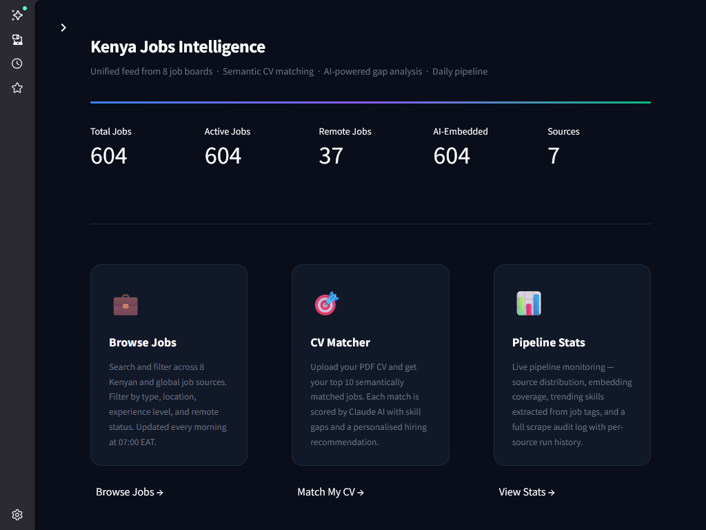
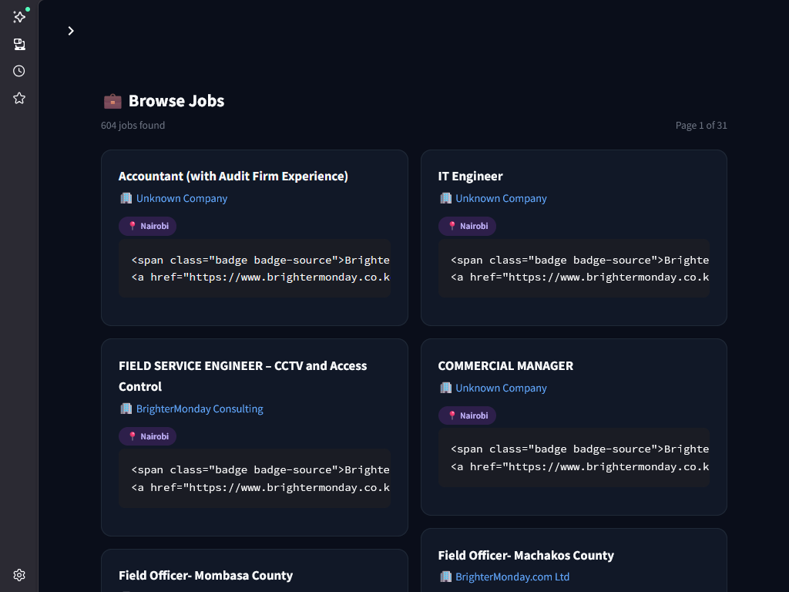
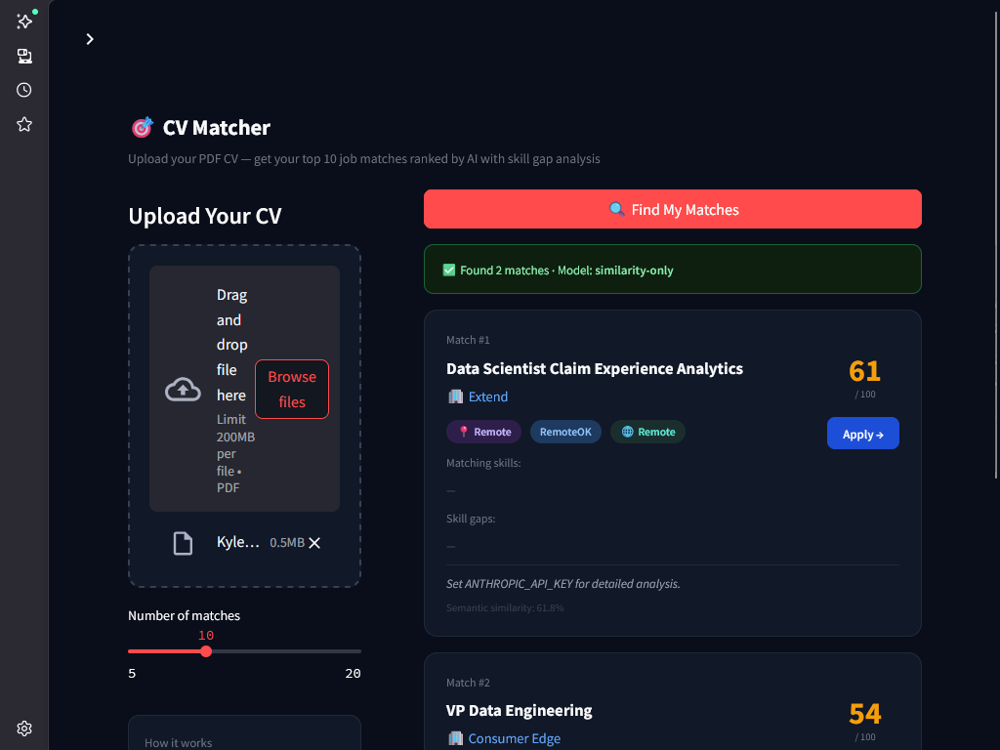
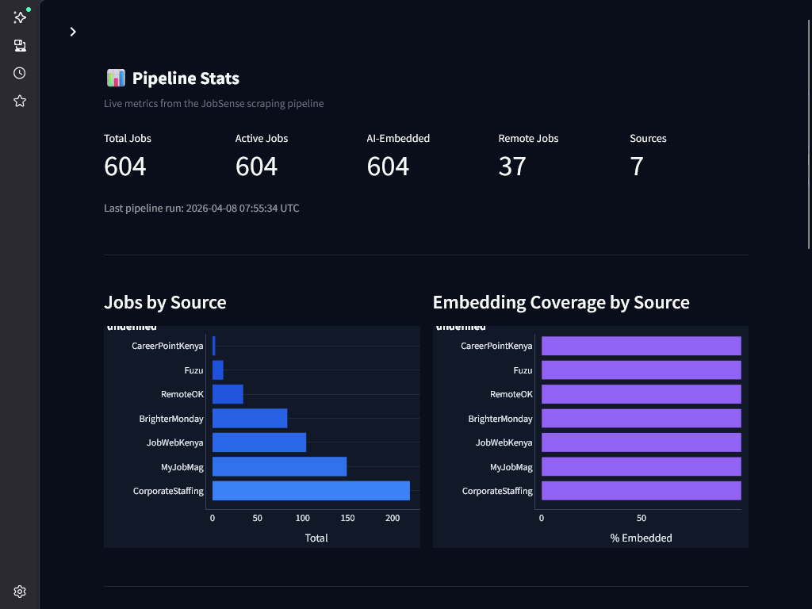
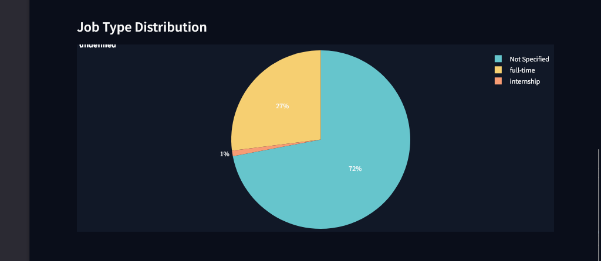
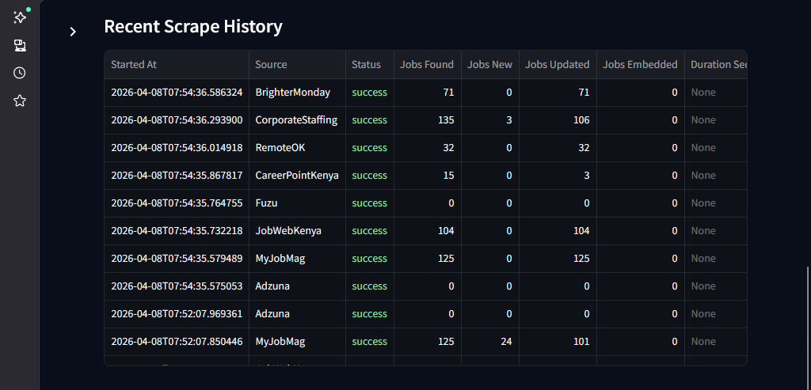
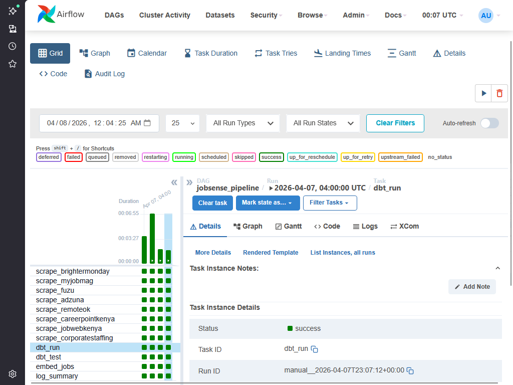
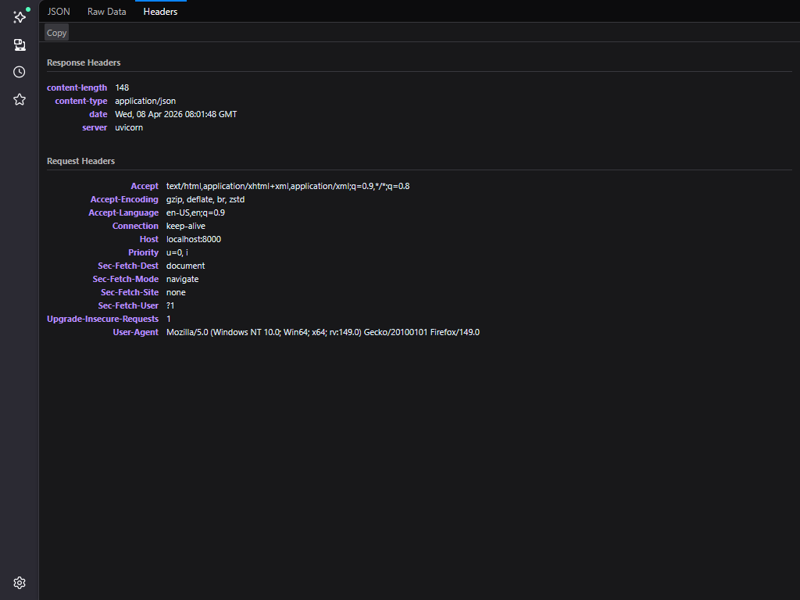

# 🔍 JobSense: Kenya Jobs Intelligence Platform

**JobSense** is a production-grade data engineering platform designed to bridge the gap between raw job posting data and intelligent career decision-making. It continuously scrapes 8 configured Kenyan and global job sources (7 active, Adzuna requiring a free API key), transforms listings through a three-layer dbt analytics pipeline, generates 384-dimensional semantic embeddings stored in pgvector, and exposes job search, semantic similarity, and AI-powered CV matching through a FastAPI REST layer and a Streamlit dashboard backed by Claude Haiku.

---

## 🎯 Project Goal

Kenya's job market is fragmented across dozens of portals — BrighterMonday, Fuzu, CareerPoint, MyJobMag, CorporateStaffing, JobWebKenya, Adzuna, and RemoteOK each hold partial data with no unified interface. Candidates waste hours copy-pasting their CV into each site with no systematic way to identify the roles that best match their skills.

JobSense solves this by running a nightly Airflow pipeline that harvests all active listings, normalises them through dbt marts, embeds them with a locally-hosted sentence-transformer model, and serves a semantic search API where uploading a PDF CV returns the top-10 best-fit jobs with Claude-generated match scores, skill gap analysis, and hiring recommendations — entirely within a single Docker Compose stack.

---

## 🧬 System Architecture

1. **Ingestion (Scrapers)** — 8 source-specific scrapers (requests + BeautifulSoup for static sites, Playwright for SPAs) write raw job records to PostgreSQL via an idempotent `ON CONFLICT` upsert
2. **Orchestration (Airflow)** — A 12-task DAG fans out all 8 scrapers in parallel, gates on success, then sequences dbt → embed → summary
3. **Transformation (dbt)** — Three-tier dbt pipeline: staging view (deduplication + normalisation) → intermediate enrichment (derived fields) → 4 mart tables (active listings, source stats, skill frequency, location stats)
4. **Embedding (pgvector)** — sentence-transformers `all-MiniLM-L6-v2` generates 384-dimensional vectors per job; stored in a `vector(384)` column with an IVFFlat cosine-similarity index
5. **API Layer (FastAPI)** — 5 REST endpoints: filtered paginated job search, pipeline stats, per-source breakdown, scrape audit log, and CV-match
6. **CV Matching (Claude Haiku)** — Upload a PDF CV → pdfplumber extracts text → pgvector finds top-k semantically similar jobs → Claude Haiku returns match score, strengths, gaps, and recommendation per job
7. **Dashboard (Streamlit)** — 4-page frontend: home stats, browse + filter jobs, CV matcher with file upload, and live pipeline metrics

---

## 🛠️ Technical Stack

| **Layer** | **Tool** | **Version** |
|---|---|---|
| Orchestration | Apache Airflow | 2.8.4 |
| Database | PostgreSQL + pgvector | 15 / 0.8.2 |
| Transformation | dbt-postgres | 1.7.4 |
| Embeddings | sentence-transformers (all-MiniLM-L6-v2) | 3.2.1 |
| Vector search | pgvector (IVFFlat, cosine similarity) | 0.3.5 |
| API Framework | FastAPI + Uvicorn | 0.115.0 |
| LLM Analysis | Anthropic Claude Haiku 4.5 | claude-haiku-4-5-20251001 |
| Dashboard | Streamlit | 1.40.1 |
| Web Scraping | requests + BeautifulSoup4 + Playwright | 2.32.3 / 4.12.3 / 1.47.0 |
| PDF Parsing | pdfplumber | 0.11.4 |
| Containerisation | Docker Compose | 6 services |
| Language | Python | 3.11 |

---

## 📊 Performance & Results

- **604 jobs** harvested in a single DAG run across 8 configured sources
- **7 active sources:** CorporateStaffing (219), MyJobMag (149), JobWebKenya (104), BrighterMonday (83), RemoteOK (34), Fuzu (12), CareerPointKenya (3)
- **604/604 embeddings** generated — 100% embedding coverage on the first pipeline run
- **37 remote-eligible** roles identified across all active sources
- **12/12 Airflow tasks** completed SUCCESS in the validated run
- **6/6 dbt models** materialised with **20/20 tests PASS** (0 failures, 0 warnings escalated)
- **Airflow DAG** scheduled daily at 04:00 UTC (07:00 EAT) with fan-out scraping and sequential post-processing
- **IVFFlat index** auto-built by the embedder after ≥ 100 vectors are stored — sub-millisecond cosine similarity queries at scale
- **API response** `GET /api/stats`: `{"total_jobs": 604, "active_jobs": 604, "embedded_jobs": 604, "remote_jobs": 37, "sources": 7}`

---

## 🌐 Job Sources

| **Source** | **Type** | **Method** | **Geography** |
|---|---|---|---|
| BrighterMonday | Job board | Playwright (API interception) | Kenya |
| MyJobMag | Job board | requests + BS4 | Kenya |
| Fuzu | Career platform | Playwright (JS challenge bypass) | Kenya / East Africa |
| Adzuna | Aggregator | REST API (JSON) | Global |
| RemoteOK | Remote jobs | REST API (JSON) | Global (remote) |
| CareerPointKenya | Job board | requests + BS4 | Kenya |
| JobWebKenya | Job board | requests + BS4 | Kenya |
| CorporateStaffing | Recruitment firm | requests + BS4 | Kenya |

---

## 🧠 Key Design Decisions

- **CPU-only PyTorch:** `torch==2.4.1+cpu` from the PyTorch wheel index reduces the Docker image by ~1.8 GB versus the default CUDA build, making the stack viable on any machine without a GPU
- **pgvector over Pinecone/Weaviate:** Keeping embeddings inside PostgreSQL eliminates a separate vector database service, reduces operational complexity, and allows SQL joins between job metadata and embedding queries in a single statement
- **Sentence-transformers baked into the image:** `all-MiniLM-L6-v2` is downloaded at image build time so the pipeline has zero network dependency at runtime — critical for a scheduled overnight job
- **Idempotent upsert with batch deduplication:** The `ON CONFLICT (source, external_id) DO UPDATE` pattern ensures re-runs never create duplicates; a pre-upsert deduplication pass prevents PostgreSQL cardinality violations when a scraper returns the same listing twice in one batch
- **Claude Haiku fallback:** The CV-match endpoint gracefully degrades to similarity-only scores when `ANTHROPIC_API_KEY` is not set — the core pipeline functions without any cloud API credentials
- **Separate requirements files:** `requirements.txt` (API + Streamlit image) and `requirements.airflow.txt` (Airflow image) prevent version conflicts — Airflow 2.8.4 requires `sqlalchemy==1.4.52` while the API layer can use current versions
- **Brotli exclusion from Accept-Encoding:** The requests session strips `br` from `Accept-Encoding` because the standard requests library cannot decode brotli-compressed responses — removing it prevents silent data corruption on Kenyan job sites that serve brotli by default
- **IVFFlat auto-build threshold:** The embedder defers IVFFlat index creation until ≥ 100 vectors exist, avoiding index build failures on early pipeline runs with sparse data

---

## 📂 Project Structure

```text
jobsense/
├── api/                          # FastAPI application
│   ├── main.py                   # App factory, CORS, router registration
│   ├── database.py               # SQLAlchemy engine + session
│   ├── models.py                 # ORM models: Job, ScrapeLog
│   ├── schemas.py                # Pydantic response schemas
│   └── routers/
│       ├── jobs.py               # GET /api/jobs, /api/stats, /api/sources, /api/scrape-logs
│       └── cv_match.py           # POST /api/cv-match (PDF upload → Claude analysis)
├── config/
│   └── settings.py               # Pydantic Settings loaded from .env
├── dags/
│   └── jobsense_dag.py           # 12-task Airflow DAG (8 scrapers + dbt + embed + summary)
├── dbt/
│   ├── models/
│   │   ├── staging/              # stg_jobs (view)
│   │   ├── intermediate/         # int_jobs_enriched (view)
│   │   └── marts/                # mart_jobs_active, mart_source_stats,
│   │                             #   mart_skill_freq, mart_location_stats
│   ├── packages.yml              # dbt_utils dependency
│   └── profiles.yml              # PostgreSQL target (env-var driven)
├── frontend/
│   ├── app.py                    # Streamlit home page (live KPI stats)
│   └── pages/
│       ├── 01_Browse_Jobs.py     # Filtered job search table
│       ├── 02_CV_Matcher.py      # PDF upload → ranked match results
│       └── 03_Pipeline_Stats.py  # Source breakdown + scrape audit log
├── pipeline/
│   ├── cleaner.py                # Text normalisation, salary extraction
│   └── embedder.py               # sentence-transformers encode + pgvector upsert
├── scrapers/
│   ├── base_scraper.py           # BaseScraper ABC, JobData dataclass, UA rotation
│   ├── runner.py                 # scrape → clean → upsert → log orchestrator
│   ├── brightermonday.py
│   ├── myjobmag.py
│   ├── fuzu.py
│   ├── adzuna.py
│   ├── remoteok.py
│   ├── careerpointkenya.py
│   ├── jobwebkenya.py
│   └── corporatestaffing.py
├── setup/
│   └── init_db.sql               # Schema DDL: jobs, scrape_logs, keyword_priorities,
│                                  #   3 views, 8 indexes, 1 trigger
├── tests/
│   ├── test_scrapers.py
│   ├── test_cleaner.py
│   ├── test_embedder.py
│   └── test_cv_match.py
├── Dockerfile                    # API + Streamlit image (CPU-only torch)
├── Dockerfile.airflow            # Airflow image (CPU torch + Playwright chromium)
├── docker-compose.yml            # 6 services: postgres, airflow-init/webserver/scheduler, api, streamlit
├── requirements.txt              # API + Streamlit dependencies
├── requirements.airflow.txt      # Airflow dependencies (sqlalchemy==1.4.52 pinned)
└── .env.example                  # Environment variable template
```

---

## ⚙️ Installation & Setup

### Prerequisites
- Docker Desktop (WSL2 backend on Windows)
- 8 GB RAM recommended (Airflow + sentence-transformers model)
- Optional: Anthropic API key for Claude-powered CV matching

### Steps

1. **Clone the repository**
   ```bash
   git clone https://github.com/declerke/JobSense.git
   cd JobSense
   ```

2. **Configure environment**
   ```bash
   cp .env.example .env
   # Edit .env — set ADZUNA_APP_ID, ADZUNA_APP_KEY, ANTHROPIC_API_KEY (optional)
   ```

3. **Build and start all services**
   ```bash
   docker-compose up --build -d
   ```
   First build downloads `all-MiniLM-L6-v2` (~90 MB) and CPU-only PyTorch (~200 MB).

4. **Wait for initialisation** (~3–5 minutes on first run)
   ```bash
   docker-compose logs -f airflow-init
   # Wait until the init container exits with code 0
   ```

5. **Trigger the pipeline**
   - Open Airflow at `http://localhost:8080` (admin / admin)
   - Enable and trigger the `jobsense_pipeline` DAG
   - 12-task run completes in ~15–25 minutes

6. **Access the stack**

| Service | URL |
|---|---|
| Streamlit Dashboard | http://localhost:8501 |
| FastAPI Docs (Swagger) | http://localhost:8000/docs |
| Airflow UI | http://localhost:8080 |
| PostgreSQL | localhost:5432 (db: jobsense) |

---

## 📸 Screenshots

**Dashboard Home** — 5 live KPI cards: 604 total jobs, 604 AI-embedded, 37 remote, 7 active sources



---

**Browse Jobs** — Filterable job cards served from the FastAPI backend; each card shows title, company, source badge, and job type



---

**CV Matcher** — Upload a PDF CV; pgvector retrieves semantically similar roles; Claude Haiku returns a match score, strengths, skill gaps, and hiring recommendation per job



---

**Pipeline Stats** — Live pipeline metrics with Jobs by Source bar chart and 100% Embedding Coverage by Source



| Job Type Distribution | Recent Scrape History |
|---|---|
|  |  |

---

**Airflow DAG** — All 12 tasks green in the `jobsense_pipeline` DAG run: 8 parallel scrapers → dbt_run → dbt_test → embed_jobs → log_summary



---

**FastAPI Backend** — Uvicorn serving `application/json` responses; full OpenAPI docs at `/docs`



---

## 🗄️ dbt Model Layers

| **Model** | **Type** | **Description** |
|---|---|---|
| `stg_jobs` | View | Deduplication, lowercase normalisation, inactive job filter |
| `int_jobs_enriched` | View | Derived `job_type_clean`, `experience_clean`, `salary_midpoint` |
| `mart_jobs_active` | Table | Full enriched active listings for API + dashboard consumption |
| `mart_source_stats` | Table | Daily job counts aggregated per source for pipeline monitoring |
| `mart_skill_freq` | Table | Top 30 trending skills from job tags in the last 30 days |
| `mart_location_stats` | Table | Job counts grouped by normalised Kenyan city name |

**20 dbt tests — 20/20 PASS:**
- Source tests on raw `jobs` table: `unique`, `not_null` on `id`, `title`, `source`
- `stg_jobs`: `unique`/`not_null` on `id`; `accepted_values` on `source` (8 whitelisted), `job_type`, `experience_level`
- `int_jobs_enriched`: `unique`/`not_null` on `id`; `not_null` + `accepted_values` on `job_type_clean`, `experience_clean`
- `mart_jobs_active`: `unique`/`not_null` on `id`; `not_null` on `title` and `source`

---

## 🎓 Skills Demonstrated

- **Multi-source web scraping** — 8 scrapers using requests + BeautifulSoup4 (static sites) and Playwright (SPAs), with user-agent rotation, exponential-backoff retry, brotli-safe Accept-Encoding headers, and JSON API integration
- **Apache Airflow DAG design** — 12-task fan-out/fan-in DAG with parallel scraping, XCom result passing, BashOperator dbt integration, full PATH injection, and daily EAT-timezone schedule
- **dbt three-tier analytics engineering** — staging → intermediate → mart pattern with source tests, `accepted_values` constraints, and 100% test pass rate on PostgreSQL 15
- **Vector embeddings with pgvector** — sentence-transformers model baked into Docker image; IVFFlat cosine-similarity index with deferred build; cosine distance queries via `<=>` operator
- **LLM integration with Claude API** — structured JSON output extraction from Claude Haiku; graceful degradation to similarity-only mode when API key absent; PDF text extraction via pdfplumber
- **FastAPI REST API design** — paginated job search with multi-field filtering, OpenAPI schema, CORS middleware, SQLAlchemy ORM, Pydantic v2 response models, and live health endpoint
- **Streamlit multi-page dashboard** — 4-page app consuming the FastAPI backend with live KPI cards, filterable job table, PDF CV upload form, and pipeline monitoring view
- **PostgreSQL advanced schema design** — GIN full-text search index on composite tsvector, IVFFlat vector index, `ON CONFLICT DO UPDATE` idempotent upserts, auto-computed duration trigger on scrape_logs
- **Docker multi-image composition** — separate Dockerfile per service layer (API vs Airflow), CPU-only PyTorch to minimise image size, health-check dependency ordering, and named volume persistence
- **Production error handling** — transaction rollback before audit log on upsert failure; batch deduplication to prevent `CardinalityViolation`; Accept-Encoding control to prevent brotli decode corruption
